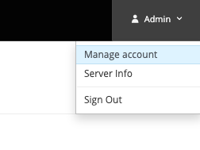
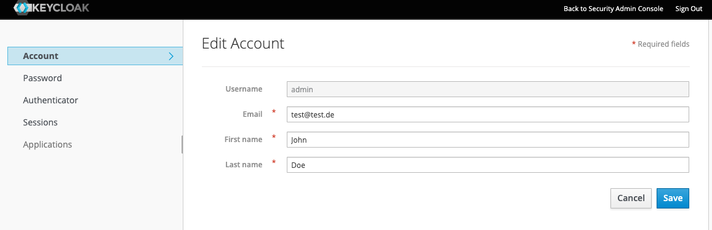
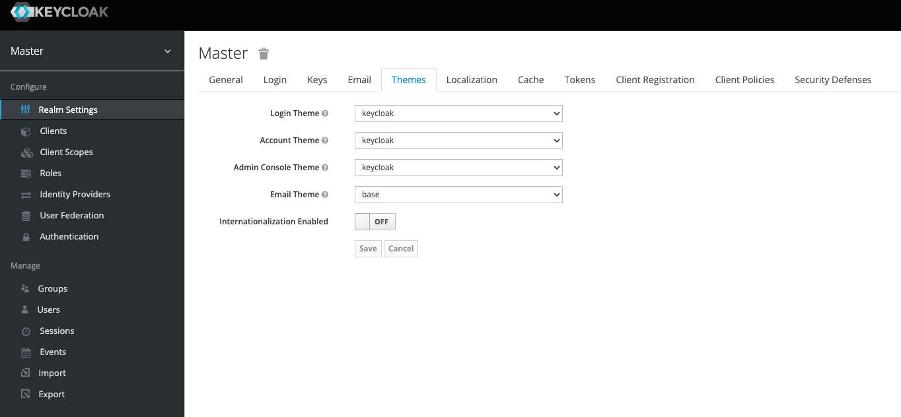
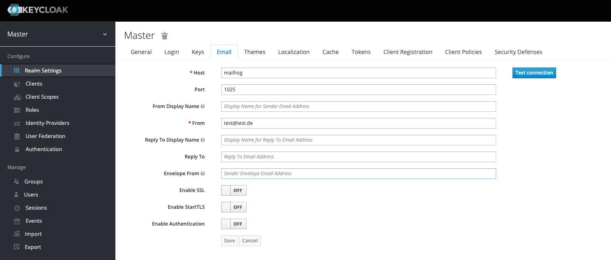

# Keycloak SPI to send emails with attachment

## getting started

```shell
make build
make start
```

visit [http://localhost:8080/auth/admin](http://localhost:8080/auth/admin). enter:

* username: admin
* password: admin

add an email to the admin account:  



Go back to the admin area.  
Change the e-mail theme to base


Go to the email settings and enter config for mailhog


click "test connection".

The mail client running on [http://localhost:8025](http://localhost:8025) should list a test-mail with the pdf
attachment.

## configuration for your keycloak

* You need to mount or copy the built jar file into `/opt/jboss/keycloak/standalone/deployments/` like it's done in
  the [Dockerfile](./Dockerfile).
* You need to insert the following code into your standalone-ha.xml file
```xml
<spi name="emailSender">
    <default-provider>emailwithattachment</default-provider>
    <provider name="emailwithattachment" enabled="true"></provider>
</spi>
```
* The email-template for the email that should be sent with attachment should include a special div tag:
```html
<div src="cid:testfile"></div>
```
`testfile` can be replaced with any variable name you would like to use.
* the chosen `cid` need to be specified in the theme.properties file like
```
attach_testfile=files/test.pdf          // if the cid is testfile
attach_[cid]=files/another_test.pdf     // replace [cid] with your cid
```
* the specified file need to placed inside the [resources/...](./data/keycloak/themes/base/email/resources/) as base path
